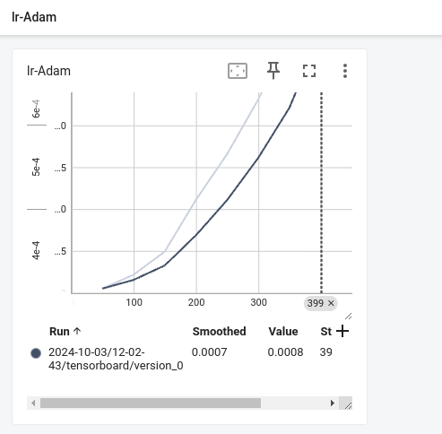

<div align="center">
# DogBreedsClassifier

[](https://github.com/pre-commit/pre-commit)
[](https://pytorch.org/get-started/locally/)
[](https://pytorchlightning.ai/)
[](https://hydra.cc/)
[](https://black.readthedocs.io/en/stable/)
[](https://pycqa.github.io/isort/) 
  <br>
[](https://codecov.io/gh/ashleve/lightning-hydra-template)  <br>


 <br>


 <br>
[](https://github.com/ashleve/lightning-hydra-template#license)


## Main Technologies

[PyTorch Lightning](https://github.com/PyTorchLightning/pytorch-lightning) - a lightweight PyTorch wrapper for high-performance AI research. Think of it as a framework for organizing your PyTorch code.

[Hydra](https://github.com/facebookresearch/hydra) - a framework for elegantly configuring complex applications. The key feature is the ability to dynamically create a hierarchical configuration by composition and override it through config files and the command line.

[DVC](https://dvc.org/) - A tool designed to handle large datasets and machine learning models in a version-controlled workflow

[Tensorboard](https://www.tensorflow.org/tensorboard) - TensorBoard is a tool that provides visualization and debugging capabilities for TensorFlow and PyTorch experiments. It’s a popular choice for monitoring machine learning training processes in real time.

[AWS|EC2|S3|Lambda|ECR](https://aws.amazon.com/ec2/) - AWS Elastic Compute Cloud (EC2) is a service that provides scalable virtual computing resources in the cloud.

[Docker](https://www.docker.com/) - A platform for creating, deploying, and managing lightweight, portable, and scalable containers.

[Gradio](https://www.gradio.app/) - A Python library for building simple, interactive web interfaces for machine learning models and APIs.


## WORKFLows
[](https://github.com/Muthukamalan/DogBreedsClassifier/actions/workflows/ci-train.yml)
[](https://github.com/Muthukamalan/DogBreedsClassifier/actions/workflows/ci-eval.yml)
[](https://github.com/Muthukamalan/DogBreedsClassifier/actions/workflows/ci-infer.yml)
[](https://github.com/Muthukamalan/DogBreedsClassifier/actions/workflows/cd-codecov.yml)
[](https://github.com/Muthukamalan/DogBreedsClassifier/actions/workflows/cd-deploy.yml)

</div>


## Project Structure
```bash
.
├── .devcontainer            <- vscode
│   └── devcontainer.json
|
├── .github                   <- Github Actions workflows
│   ├── ci-eval.yml   
│   ├── ci-codecov.yml   
│   ├── ci-test.yml
│   ├── ci-train.yml
│   └── ci-deploy.yml
├── assets
│   ├── hparams-artifacts.png
│   ├── MambaOutHparamSearch.png
│   ├── MambaOutHparamsTestScores.png
│   ├── OptunaHparams.png
│   ├── runner-ec2-training.png
│   └── self-hosted-runners.png
|
├── configs                                                 <- Hydra configs
│      ├── callbacks                                        <- callback config
│      │   ├── default.yaml
│      │   ├── early_stopping.yaml
│      │   ├── learning_rate_monitor.yaml
|      │   ├── model_checkpoint.yaml
│      │   ├── model_summary.yaml
│      │   ├── none.yaml
│      │   └── rich_progress_bar.yaml
│      ├── data                                             <- data config
│      │   └── dogs.yaml
│      ├── debug                                            <- debug config
│      │   ├── default.yaml
│      │   ├── fdr.yaml
│      │   ├── limit.yaml
│      │   ├── overfit.yaml
│      │   └── profiler.yaml
│      ├── experiment                                       <- experiment config
│      │   └── finetune.yaml
│      ├── extras                                           <- extras config
│      │   └── default.yaml
│      ├── hparams_search                                   <- hparams config
│      │   └── mnist_optuna.yaml
│      ├── hydra                                            <- hydra config
│      │   └── default.yaml
│      ├── logger                                           <- logger config
│      │   ├── aim.yaml
│      │   ├── comet.yaml
│      │   ├── csv.yaml
│      │   ├── default.yaml
│      │   ├── many_loggers.yaml
│      │   ├── mlflow.yaml
│      │   ├── neptune.yaml
│      │   ├── tensorboard.yaml
│      │   └── wandb.yaml
│      ├── model                                            <- model config
│      │   ├── mamba.yaml
│      │   ├── mnist.yaml
│      │   └── timm_classify.yaml
│      ├── paths                                            <- path config
│      │   └── default.yaml 
│      ├── trainer                                          <- trainer config
│      │   ├── cpu.yaml
│      │   ├── ddp_sim.yaml
│      │   ├── ddp.yaml
│      │   ├── default.yaml
│      │   ├── gpu.yaml
│      │   └── mps.yaml
│      ├── __init__.py
│      ├── eval.yaml                                        <- evalution config
│      └── train.yaml                                       <- training config
|
├── data                                                    <- DATASET
│   ├── dogs_dataset
│   │   ├── test
│   │   ├── train
│   │   └── validation
│   └── dogs_dataset.dvc
├── dvc.lock
├── dvc.yaml                                                <- DVC
├── environment.yaml                                        <- conda export `conda env export|grep -v "^prefix: " > environment.yml`
|
|
├── LICENSE
├── logs                   <- Logs generated by hydra and lightning loggers
├── multirun               <- Logs for Hparams Search
├── outputs                <- Logs for eval/fastrun 
|
├── notebooks              <- Jupyter notebooks
|
├── reports
│   ├── lr-Adam.png
│   ├── test-report.png
│   ├── train-report.png
│   └── val-report.png
|
|
├── samples                        <- inference
│   ├── checkpoints 
│   │   └── epoch_019.ckpt
│   ├── inputs
│   │   ├── guess1.jpg
│   │   └── guess2.jpg
│   └── outputs
|
├── scripts                         <- Shell scripts
├── setup.py                        
|
├── src
│   ├── datamodules
│   │   └── dogs_datamodule.py
│   ├── models
│   │   └── dogs_classifier.py
│   ├── utils
│   │   ├── __init__.py
│   │   ├── instantiators.py
│   │   ├── logging_utils.py
│   │   ├── pylogger.py
│   │   ├── rich_utils.py
│   │   └── utils.py
│   ├── __init__.py
│   ├── inference.py
│   ├── train.py
|   └── eval.py
|
├── gradio                                  <- GRADIO Space Huggingspace
│   ├── .gradio/worflows
│   │    └── update-space.yaml      
│   ├── examples                            <- examples
│   │   ├── guess1.jpg
│   │   └── guess2.jpg
│   ├── app.py
│   ├── best_model.pt
│   ├── dvc.lock
│   ├── README.md
│   └── requirements.txt
|
├── tests                                                  <- Pytest
│   ├── datamodules
│   │   └── test_dogs_datamodule.py
│   ├── models
│   │   └── test_dogs_classifier.py
│   ├── test_eval.py
│   └── test_train.py
│
├── Makefile
├── requirements.txt                                        <- requirements+GPU
├── requirements.txt.cpu                                    <- requirements+CPU
|
├── Dockerfile                                              <- Dockerfile+GPU
├── Dockerfile.cpu                                          <- Dockerfile+CPU
├── compose.yml                                             <- docker-compose
│   
├── pyproject.toml                                          
├── ruff.toml                                               <- ruff check --fix 
├── pytest.ini                                              <- pytest config
|
├── .env
├── coverage.xml
|
└── README.md

79 directories, 107 files
```


## Logs

Hydra creates new output directory for every executed run.

Default logging structure:

```log
├── logs
│   ├── task_name
│   │   ├── runs                        # Logs generated by single runs
│   │   │   ├── YYYY-MM-DD_HH-MM-SS       # Datetime of the run
│   │   │   │   ├── .hydra                  # Hydra logs
│   │   │   │   ├── csv                     # Csv logs
│   │   │   │   ├── wandb                   # Weights&Biases logs
│   │   │   │   ├── checkpoints             # Training checkpoints
│   │   │   │   └── ...                     # Any other thing saved during training
│   │   │   └── ...
│   │   │
│   │   └── multiruns                   # Logs generated by multiruns
│   │       ├── YYYY-MM-DD_HH-MM-SS       # Datetime of the multirun
│   │       │   ├──1                        # Multirun job number
│   │       │   ├──2
│   │       │   └── ...
│   │       └── ...
│   │
│   └── debugs                          # Logs generated when debugging config is attached
│       └── ...
```


## Data Setup
```.env
#AWS
AWS_ACCESS_KEY_ID= 
AWS_SECRET_ACCESS_KEY=
#Dockerhub
DOCKER_USERNAME=
DOCKER_PASSWORD=
#Code-coverage
CODECOV=
#HF
HF_TOKEN=
```
# Runner-Setup
<div align='center'> </div>


## Clean 
```sh
make trash
make clean
```


## Training

#### fastrun
training simple model
```sh
make fastrun
make sshow
```

### Hparms:: Optuna
<div align='center'> </div>

##### Loss & Accuracy Curves
- Train DataLoader
- Val DataLoader
<div align='center'> </div>
- Test DataLoader
<div align='center'> </div>

#### LearningRate


### Artifacts in S3 🪣
<div align='center'> </div>


## Test- PyTest
```sh
make test

============================================================================== test session starts ==============================================================================
platform linux -- Python 3.11.9, pytest-8.3.3, pluggy-1.5.0
rootdir: /home/muthu/GitHub/DogBreedsClassifier
configfile: pytest.ini
plugins: cov-5.0.0, anyio-3.7.1, time-machine-2.15.0, hydra-core-1.3.2
collected 6 items                                                                                                                                                               

tests/datamodules/test_dogs_datamodule.py ...                                                                                                                             [ 50%]
tests/models/test_dogs_classifier.py .                                                                                                                                    [ 66%]
tests/test_eval.py .                                                                                                                                                      [ 83%]
tests/test_train.py .                                                                                                                                                     [100%]
=========================================================================================== warnings summary ============================================================================================
../../miniconda3/envs/venv/lib/python3.11/site-packages/jupyter_client/connect.py:22
  /home/muthu/miniconda3/envs/venv/lib/python3.11/site-packages/jupyter_client/connect.py:22: DeprecationWarning: Jupyter is migrating its paths to use standard platformdirs
  given by the platformdirs library.  To remove this warning and
  see the appropriate new directories, set the environment variable
  `JUPYTER_PLATFORM_DIRS=1` and then run `jupyter --paths`.
  The use of platformdirs will be the default in `jupyter_core` v6
    from jupyter_core.paths import jupyter_data_dir, jupyter_runtime_dir, secure_write

tests/test_eval.py::test_catdog_ex_testing
tests/test_train.py::test_catdog_ex_training
  /home/muthu/miniconda3/envs/venv/lib/python3.11/site-packages/lightning/fabric/connector.py:571: `precision=16` is supported for historical reasons but its usage is discouraged. Please set your precision to 16-mixed instead!

tests/test_train.py::test_catdog_ex_training
  /home/muthu/miniconda3/envs/venv/lib/python3.11/site-packages/lightning/pytorch/loops/fit_loop.py:298: The number of training batches (8) is smaller than the logging interval Trainer(log_every_n_steps=50). Set a lower value for log_every_n_steps if you want to see logs for the training epoch.

tests/test_train.py::test_catdog_ex_training
  /home/muthu/miniconda3/envs/venv/lib/python3.11/site-packages/torch/optim/lr_scheduler.py:224: UserWarning: Detected call of `lr_scheduler.step()` before `optimizer.step()`. In PyTorch 1.1.0 and later, you should call them in the opposite order: `optimizer.step()` before `lr_scheduler.step()`.  Failure to do this will result in PyTorch skipping the first value of the learning rate schedule. See more details at https://pytorch.org/docs/stable/optim.html#how-to-adjust-learning-rate
    warnings.warn(

-- Docs: https://docs.pytest.org/en/stable/how-to/capture-warnings.html
=========================================================================================== warnings summary ============================================================================================
../../miniconda3/envs/venv/lib/python3.11/site-packages/jupyter_client/connect.py:22
  /home/muthu/miniconda3/envs/venv/lib/python3.11/site-packages/jupyter_client/connect.py:22: DeprecationWarning: Jupyter is migrating its paths to use standard platformdirs
  given by the platformdirs library.  To remove this warning and
  see the appropriate new directories, set the environment variable
  `JUPYTER_PLATFORM_DIRS=1` and then run `jupyter --paths`.
  The use of platformdirs will be the default in `jupyter_core` v6
    from jupyter_core.paths import jupyter_data_dir, jupyter_runtime_dir, secure_write

tests/test_eval.py::test_catdog_ex_testing
tests/test_train.py::test_catdog_ex_training
  /home/muthu/miniconda3/envs/venv/lib/python3.11/site-packages/lightning/fabric/connector.py:571: `precision=16` is supported for historical reasons but its usage is discouraged. Please set your precision to 16-mixed instead!

tests/test_train.py::test_catdog_ex_training
  /home/muthu/miniconda3/envs/venv/lib/python3.11/site-packages/lightning/pytorch/loops/fit_loop.py:298: The number of training batches (8) is smaller than the logging interval Trainer(log_every_n_steps=50). Set a lower value for log_every_n_steps if you want to see logs for the training epoch.

tests/test_train.py::test_catdog_ex_training
  /home/muthu/miniconda3/envs/venv/lib/python3.11/site-packages/torch/optim/lr_scheduler.py:224: UserWarning: Detected call of `lr_scheduler.step()` before `optimizer.step()`. In PyTorch 1.1.0 and later, you should call them in the opposite order: `optimizer.step()` before `lr_scheduler.step()`.  Failure to do this will result in PyTorch skipping the first value of the learning rate schedule. See more details at https://pytorch.org/docs/stable/optim.html#how-to-adjust-learning-rate
    warnings.warn(

-- Docs: https://docs.pytest.org/en/stable/how-to/capture-warnings.html
==================================================================================== 6 passed, 5 warnings in 33.11s =====================================================================================
```


## Eval
#### confusion matrix
<!-- - Train DataLoader
<div align='center'> </div>

- Val DataLoader
<div align='center'> </div>

- Test DataLoader
<div align='center'> </div> -->
| Train Matrix    | Val Matrix | Test  Matrix  |
|-----------------|------------|-------------|
| <div align='center'></div> | <div align='center'></div> | <div align='center'></div> |


## prediction
```
args:
    --input_folder
    --output_folder # where to save
    --ckpt_path
```
<div style="display: flex; justify-content: center;">
    
    
</div>


## Clean
```sh
make trash
make clean
```


## Inference

```log
2024-11-10 20:22:17 | INFO     | utils.logging_utils:wrapper:22 - Starting load_image
2024-11-10 20:22:17 | INFO     | utils.logging_utils:wrapper:25 - Finished load_image
2024-11-10 20:22:17 | INFO     | utils.logging_utils:wrapper:22 - Starting infer
2024-11-10 20:22:17 | INFO     | utils.logging_utils:wrapper:25 - Finished infer
2024-11-10 20:22:17 | INFO     | utils.logging_utils:wrapper:22 - Starting save_prediction_image
2024-11-10 20:22:17 | INFO     | utils.logging_utils:wrapper:25 - Finished save_prediction_image
<class 'omegaconf.listconfig.ListConfig'> "conv_ratio":         1.2
"depths":             [3, 3, 15, 3]
2024-11-10 20:22:17 | INFO     | utils.logging_utils:wrapper:22 - Starting load_image
"dims":               [6, 12, 24, 36]
"head_fn":            default
"in_chans":           3
"lr":                 0.001
"min_lr":             1e-06
"model_name":         Mamba
"num_classes":        10
"pretrained":         False
"scheduler_factor":   0.1
"scheduler_patience": 5
"trainable":          False
"weight_decay":       1e-05
Processed guess2.jpg: Poodle (0.89)
2024-11-10 20:22:17 | INFO     | utils.logging_utils:wrapper:25 - Finished load_image
2024-11-10 20:22:17 | INFO     | utils.logging_utils:wrapper:22 - Starting infer
2024-11-10 20:22:17 | INFO     | utils.logging_utils:wrapper:25 - Finished infer
2024-11-10 20:22:17 | INFO     | utils.logging_utils:wrapper:22 - Starting save_prediction_image
2024-11-10 20:22:17 | INFO     | utils.logging_utils:wrapper:25 - Finished save_prediction_image
Processed guess1.jpg: Boxer (0.96)
2024-11-10 20:22:17 | INFO     | utils.logging_utils:wrapper:25 - Finished main
```


## Gradio
